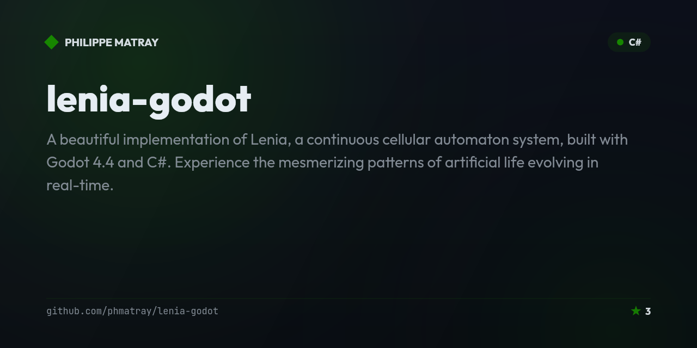

# Raga — Gacha game with Godot and gRPC

<!-- portfolio-badges:start -->
<!-- Identity -->
[](https://github.com/phmatray/Raga)

[](https://github.com/phmatray/Raga/stargazers)
[](https://github.com/phmatray/Raga/network/members)

<!-- Activity -->
[](https://github.com/phmatray/Raga/issues)
[](https://github.com/phmatray/Raga/pulls)
[](https://github.com/phmatray/Raga/commits)
<!-- portfolio-badges:end -->

<!-- portfolio-toc:start -->

## Table of Contents

- [✨ Features](#-features)
- [📦 Installation](#-installation)
- [🚀 Quick Start](#-quick-start)
- [Tech Stack](#tech-stack)
- [📄 License](#-license)
- [Contributing](#contributing)

<!-- portfolio-toc:end -->


A gacha-style game built with Godot (C# bindings) and .NET gRPC backend services. Features server-authoritative game logic, character collection mechanics, and real-time client-server communication.

## ✨ Features
- Gacha game mechanics (character pulls and collection)
- Godot engine with C# scripting
- gRPC-powered server for authoritative game logic
- Real-time client-server synchronization
- Character stat and progression system

## 📦 Installation
```bash
git clone https://github.com/phmatray/Raga
cd Raga
# Start the gRPC server
dotnet run --project Raga.Server
# Open Raga.Game in Godot 4
```

## 🚀 Quick Start
```bash
# Run the gRPC server
dotnet run --project Raga.Server

# In Godot: open Raga.Game project and press F5
```

<!-- portfolio-techstack:start -->

## Tech Stack

- **.NET 10**
- ObservableCollections.R3
- R3
- Google.Protobuf
- Grpc.Net.Client
- Grpc.Tools
- Bogus
- FluentValidation
- FluentValidation.DependencyInjectionExtensions

<!-- portfolio-techstack:end -->

<!-- portfolio-roadmap:start -->

## Roadmap

Planned work and known limitations are tracked in the [open issues](https://github.com/phmatray/Raga/issues). Contributions toward them are welcome.

<!-- portfolio-roadmap:end -->

## 📄 License
MIT — see LICENSE

---

<!-- portfolio-sections:start -->

## Contributing

Contributions are welcome. Open an issue first to discuss any significant change.

1. Fork the repository and create your branch (`git checkout -b feat/my-feature`)
2. Commit your changes (`git commit -m 'feat: ...'`)
3. Push the branch and open a Pull Request

<!-- portfolio-sections:end -->
